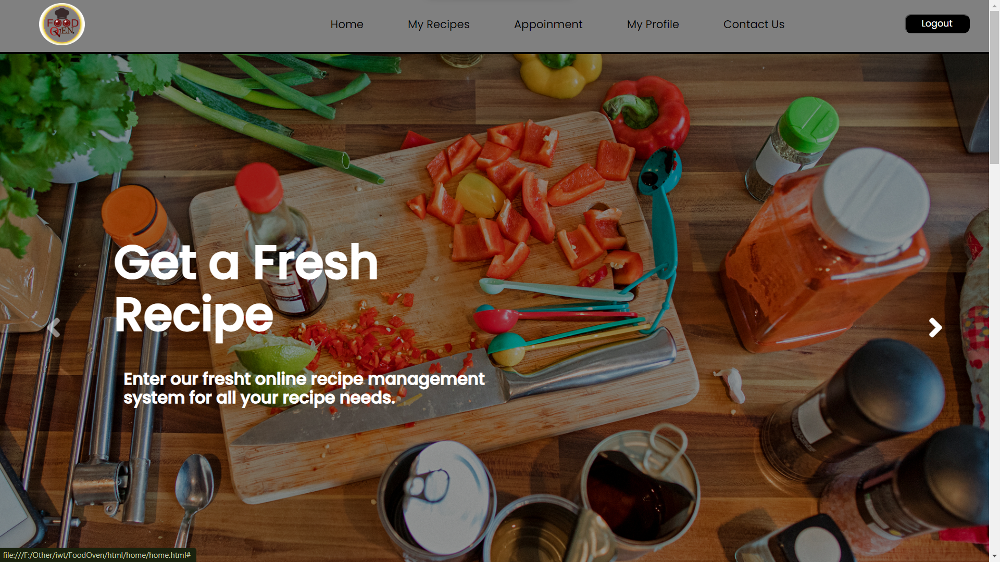

# FOODOVEN - Online Recipe Management System

FOODOVEN is an online recipe management system that allows users to manage their recipes, make appointments with nutritionists, and engage in a community of food enthusiasts. The system is developed using HTML, CSS, JavaScript, PHP, and MySQL.

## Features

- **Guest Users:**
  - Browse and read available recipes.

- **Registered Users:**
  - Create an account using the registration form.
  - Manage personal recipes (add, delete, update) via the user dashboard.
  - Make appointments with nutritionists.
  - Provide feedback on recipes.
  - Search recipes by food categories.

- **Nutritionist Dashboard:**
  - Access a dedicated dashboard for managing appointments and interactions with users.

- **Admin Panel:**
  - Recipe Management
  - Nutritionist Management
  - Contact Management
  - Category Management
  - User Management

## Getting Started

### Prerequisites

- Web server with PHP support
- MySQL database server

### Installation

 Clone the repository:

  
    git clone https://github.com/your-username/foodoven.git
    cd foodoven
  

